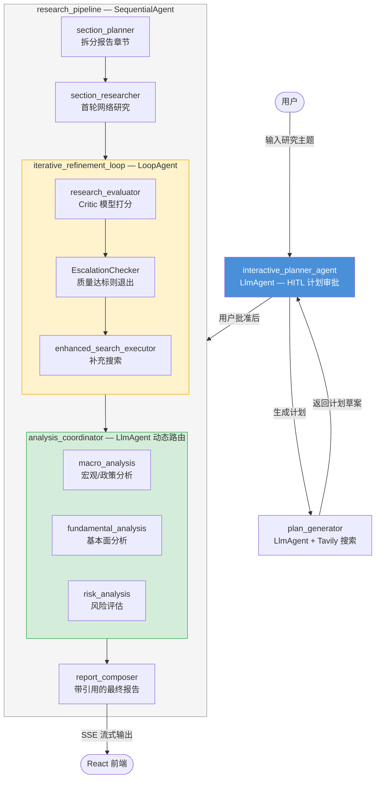

# AI 投资研究助手

> 基于 Google ADK 多智能体架构的全栈 AI 投资研究平台。用户输入研究主题 → 系统生成结构化研究计划 → 用户审批 (HITL) → 迭代式网络研究与质量自检 → 金融领域专项分析 → 输出带完整引用的研究报告。

---

## 项目亮点

- **多智能体编排**：8 个专业化 Agent 组成层次化流水线，使用 `SequentialAgent`、`LoopAgent`、`AgentTool` 三种编排模式实现确定性流程控制与动态路由的结合
- **Human-in-the-Loop**：用户必须审批研究计划后才启动执行，确保研究方向可控
- **引用溯源系统**：从 Gemini grounding metadata 自动提取来源 → 分配短 ID (`src-1`, `src-2`) → 最终报告中替换为 `[标题](URL)` 格式的可点击链接
- **金融分析流水线**：智能路由协调器根据主题类型（宏观/个股/混合）动态选择分析模块组合
- **生产级工程实践**：SSE 流式传输、API 认证中间件、RPM 限流、结构化日志、Prometheus 指标、SQLite 会话持久化、Docker 容器化、GitHub Actions CI

---

## 技术架构

### Agent 层级



### 关键设计决策

| 决策 | 选择 | 原因 |
|------|------|------|
| 研究流程 | `SequentialAgent` + `LoopAgent` | 需要确定性的"研究 → 评估 → 补充"循环，评估器打分控制退出 |
| 分析模块调用 | `AgentTool`（而非 sub_agents） | 不是每个主题都需要全部三种分析；由 LLM coordinator 根据主题动态决策调用哪些 |
| 报告生成 | `include_contents="none"` | 强制 composer 只从 session state 读取数据，保证输出确定性 |
| 质量控制 | Worker/Critic 双模型 | 研究用 worker 模型执行，评估用 critic 模型独立打分，避免自我评价偏差 |

### 技术栈

| 层级 | 技术 |
|------|------|
| Agent 框架 | Google ADK (`google-adk`) |
| LLM | Gemini 2.5 Pro（可通过环境变量切换） |
| 后端 | FastAPI (ADK 内置) + 自定义 ASGI 中间件 |
| 前端 | React 18 + TypeScript + Vite + shadcn/ui + Tailwind CSS |
| 流式传输 | Server-Sent Events (SSE) |
| 金融数据 | yfinance（行情）、FRED API（宏观）、CME FedWatch 抓取（利率概率） |
| 会话存储 | SQLite（ADK session service） |
| 容器化 | Docker + docker-compose |
| CI | GitHub Actions（pytest + ruff + tsc + vitest） |

---

## 功能演示

### 产品主页

> 暗色主题落地页，Agent 星座图实时动画展示 8 个专业化 Agent 的协作关系。


---

### Human-in-the-Loop 计划审批

> AI 生成结构化研究计划，用户逐项审阅后确认执行，确保研究方向完全可控。


---

### 实时研究过程

> SSE 流式传输将每一步 Agent 动作实时推送到前端——包括 Tavily 搜索调用、工具入参与返回结果。


---

### 最终报告与分析面板

> 三栏标签页：完整研究报告（含可点击引用链接）、宏观分析、风险评估，支持一键导出 Markdown。


---

**示例研究主题：**
- 美联储 2025 年降息路径分析及对美债市场的影响
- NVDA Q4 财报解读及 2025 年前景展望
- 中美贸易摩擦对半导体行业的长期影响分析
- 高通胀环境下黄金的避险价值与配置建议

---

## 快速启动

### 环境要求

- Python 3.12+
- Node.js 20+
- [uv](https://docs.astral.sh/uv/)（Python 包管理）

### 1. 克隆并配置环境变量

```bash
git clone <your-repo-url>
cd ADK_Learning_Project

# 后端环境变量
cp backend/app/.env.example backend/app/.env
# 编辑 .env，填入 DEEPSEEK_API_KEY 和 TAVILY_API_KEY

# 前端环境变量
cp frontend/.env.example frontend/.env
```

### 2. 启动后端

```bash
cd backend
uv sync
uv run uvicorn app.main:app --host 127.0.0.1 --port 8000 --reload
```

### 3. 启动前端

```bash
cd frontend
npm install
npm run dev    # Vite 开发服务器 → http://localhost:5173
```

- `http://localhost:5173/` — 产品主页（Agent 星座图、功能介绍、CTA）
- `http://localhost:5173/app` — 研究对话界面

### Docker 一键启动

```bash
docker-compose up --build
# 主页    → http://localhost:80/
# 对话    → http://localhost:80/app
# 后端 API → http://localhost:8000
```

---

## 项目结构

```
├── backend/
│   ├── app/
│   │   ├── agent.py                 # Root agent 组装
│   │   ├── main.py                  # FastAPI 入口 + 中间件栈
│   │   ├── callbacks.py             # 限流、引用替换、评估解析
│   │   ├── config.py                # 模型配置、环境变量
│   │   ├── observability.py         # Prometheus 指标 + OpenTelemetry
│   │   ├── persistence.py           # SQLite 会话持久化
│   │   ├── run_control.py           # SSE 运行取消机制
│   │   ├── agents/
│   │   │   ├── research/pipeline.py # 研究流水线（Sequential + Loop）
│   │   │   ├── research/prompts.py  # 各阶段 prompt
│   │   │   └── analysis/            # 宏观/基本面/风险分析 agent
│   │   └── tools/                   # 金融工具：行情、利率、声明对比、新闻
│   └── tests/                       # pytest 单元测试
│
├── frontend/
│   └── src/
│       ├── main.tsx                  # 路由入口：/ → 主页，/app → 对话
│       ├── App.tsx                   # 对话界面 + SSE 处理
│       ├── pages/
│       │   └── LandingPage.tsx       # 产品主页（Agent 星座图、功能介绍）
│       ├── styles/
│       │   └── landing.css           # 主页暗色主题（与 Tailwind 隔离）
│       ├── components/              # UI 组件（聊天、时间线、分析面板、历史）
│       ├── lib/                     # API 客户端、SSE 解析、导出、日志
│       └── __tests__/               # Vitest 测试
│
├── docker-compose.yml
├── .github/workflows/ci.yml
└── README.md
```

---

## 工程实践

| 维度 | 实现 |
|------|------|
| **CI/CD** | GitHub Actions：后端 pytest + ruff lint，前端 tsc + ESLint + vitest |
| **API 安全** | 自定义 ASGI 中间件链：API Key 认证 → Request ID 追踪 → CORS → 运行取消 |
| **限流** | Session 级别 RPM 限流，`asyncio.Lock` 保护并发读写，防止 LLM API 超额调用 |
| **可观测性** | 结构化 JSON 日志 + Request ID 关联 + Prometheus `/metrics` 端点 + OpenTelemetry tracing |
| **会话持久化** | SQLite 持久化 + TTL 自动清理后台任务 |
| **容错** | `PipelineGuard` 捕获流水线异常输出 partial result；工具调用 `ThreadPoolExecutor` + timeout |
| **容器化** | 前后端独立 Dockerfile + docker-compose 编排 + 健康检查 |
| **前端质量** | TypeScript strict 模式 + ErrorBoundary + SSE 重连 + 导出功能 |

---

## 许可证

本项目采用 [MIT 许可证](LICENSE)。
